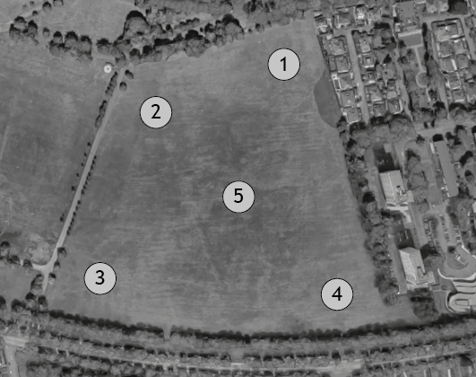
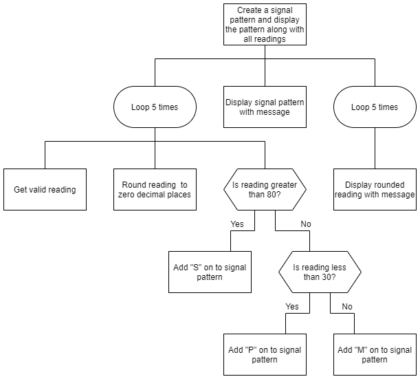

# N5 2018 - Mobile Wifi

Scotven offers a mobile wi-fi service at outdoor events. They check the signal strength by taking readings from five locations.

The analysis and design for a program is shown below:

## Program analysis

A program is required to display the five readings taken at the event and a signal pattern. The signal pattern will show the strength of readings (S = strong, M = medium and P = poor) in the order the readings were taken (1 to 5), for example “SSMPS”.

## Assumptions
* readings of signal strengths are recorded with two decimal places from 0.00% to 100.00%
* a strong signal is greater than 80% signal strength
* a medium signal is less than a strong signal and more than a poor signal
* a poor signal is less than 30% signal strength

## Inputs
* five valid readings from the venue

## Processes

* round each reading to zero decimal places
* create a five character string representing the signal pattern

## Outputs
* a message displaying the signal pattern for example:
  * Signal Pattern is: SSMPS

* the five rounded readings with each reading number for example:
  * Reading 1 - 89
  * Reading 2 - 82
  * Reading 3 - 56
  * Reading 4 - 12
  * Reading 5 - 99

## Program design (structure diagram)

___2a___ Using the program analysis and design, implement the program in a language of your choice. Ensure the program matches the structure diagram provided.  (__15 marks__)

Print evidence of your program code.

___2b___ Your program should be tested to ensure it produces different signal patterns correctly.

Complete the table below to create one set of test data that will produce the expected output for the signal pattern shown.  (__2 marks__)

<table>
 <tr>
  <th>Type of test</th>
  <th>User input</th>
  <th>Expected output for signal paterrn</th>
  <th>Actual output</th>
 </tr>
 <tr>
  <td>Normal</td>
  <td>
   <table>
    <tr>
     <td>reading 1 :</td><td> </td>
    </tr>
    <tr>
     <td>reading 2 :</td><td> </td>
    </tr>
    <tr>
     <td>reading 3 :</td><td> </td>
    </tr>
    <tr>
     <td>reading 4 :</td><td> </td>
    </tr>
    <tr>
     <td>reading 5 :</td><td> </td>
    </tr>
   </table>
  <td>Signal pattern is: MPSPS</td>
  <td>Attach printouts of inputs and outputs as evidence</td>
 </tr>
</table>

You must demonstrate that your program correctly outputs the signal pattern and the rounded readings.

Print evidence of inputs and outputs to show that you have completed the test.

___2c___ Your program should be tested to ensure that each signal strength character is correctly assigned as S, M or P. Six extreme test values are required to test this fully.

State the six test data values required:  (__3 marks__)

* Extreme 1 ____
* Extreme 2 ____
* Extreme 3 ____
* Extreme 4 ____
* Extreme 5 ____
* Extreme 6 ____

___2d___ With reference to your code, evaluate your program by commenting on the following:

* Fitness for purpose (__1 mark__)
* Where your code demonstrates efficient use of programming constructs (__1 mark__)
* Robustness of your completed program (__1 mark__)
* Readability of your code (__2 marks__)